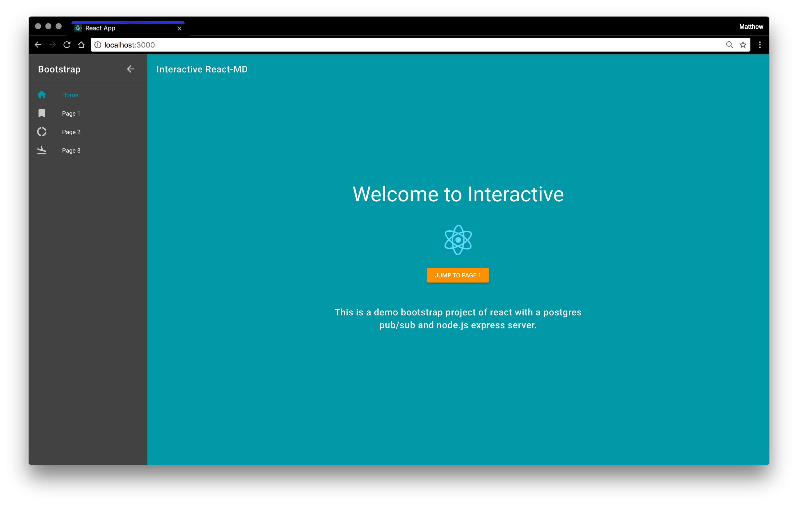
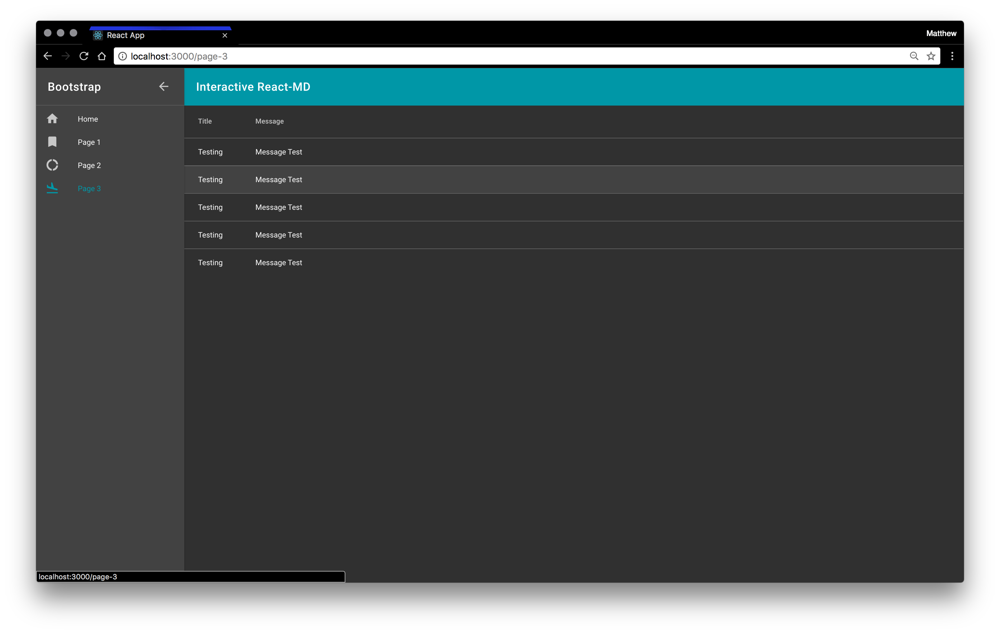

# Interactive React Bootstrap

*Server: Node.js Express Server with PostgresSQL Sequalize and Pub/Sub*

*Client: React with Material-UI (react-md) and Simple GlobalState Management*

This bootstrap project implements a react-md client with a node.js/express server. It uses a pub/sub connection to a PostgresSQL database. As soon as database records are updated, the react frontend interactively updates a simple global state.

* * *

### Run Instructions

Clone the repository:
```
git clone https://github.com/mattshax/interactive-react-md.git
cd interactive-react-md
```

Install dependencies for the client and server:
```
npm install
cd client
npm install
cd ../
```

Either install Postgres locally or start Postgres running in docker with the below command:

```
cd postgres
./startDB.sh
```

Open a new terminal and start the node client and server:

```
npm start
```

The developer hotload should open http://localhost:3000.

You should see something similar to below:

 | 
|:---:|:---:|
| | 

Add, edit and remove records using the http://localhost:3001 API:

```
# add a record
curl http://localhost:3001/api/v1/data/add

# edit a record
curl http://localhost:3001/api/v1/data/edit

# remove a record
curl http://localhost:3001/api/v1/data/edit
```

You should see the react app update immediately upon each API call.

By default it runs in development mode. To build for production you can run the commands below:

```
cd client
npm build
serve -s build
```

* * *

### PostgresSQL Pub/Sub Setup Instructions

* http://coussej.github.io/2015/09/15/Listening-to-generic-JSON-notifications-from-PostgreSQL-in-Go/

Function to create the notify events:
```
CREATE OR REPLACE FUNCTION notify_event() RETURNS TRIGGER AS $$
    DECLARE 
        data json;
        notification json;
    BEGIN
        -- Convert the old or new row to JSON, based on the kind of action.
        -- Action = DELETE?             -> OLD row
        -- Action = INSERT or UPDATE?   -> NEW row
        IF (TG_OP = 'DELETE') THEN
            data = row_to_json(OLD);
        ELSE
            data = row_to_json(NEW);
        END IF;
        -- Contruct the notification as a JSON string.
        notification = json_build_object(
                          'table',TG_TABLE_NAME,
                          'action', TG_OP,
                          'data', data);
        -- Execute pg_notify(channel, notification)
        PERFORM pg_notify('events',notification::text);
        -- Result is ignored since this is an AFTER trigger
        RETURN NULL; 
    END;
$$ LANGUAGE plpgsql;
```

Creating the trigger for each table:
```
CREATE TRIGGER user_event
AFTER INSERT OR UPDATE OR DELETE ON users
    FOR EACH ROW EXECUTE PROCEDURE notify_event();
```

Listen for the 'event' channel to get updates.

```
const PGPubsub = require('pg-pubsub');
const config = require('../config/server');
const pubsub = new PGPubsub(config.database);
const subscriber = pubsub.addChannel('events', (data) => {
    console.log('EVENT OCCURED IN ', data.table);
    messageCount += 1;
    res.write(`id: ${messageCount}\n`);
    return res.write(`data: ${data.table}\n\n`); // Note the extra newline
});
```

* * *

### Libraries and Technologies

* [PostgresSQL](https://www.postgresql.org/) – Database
* [Docker](https://www.docker.com/) – Containerizer of database
* [Node.js](https://nodejs.org/) – Server-side runtime environment
* [React-md](https://github.com/mlaursen/react-md) – React md for react material-UI framework
* [node-pg-pubsub](https://github.com/voxpelli/node-pg-pubsub) – Pub/sub for postgres database


* * *

### Copyright & License

The MIT License (MIT)

Copyright (c) 2017 - Matthew Shaxted

Permission is hereby granted, free of charge, to any person obtaining a copy of this software and associated documentation files (the "Software"), to deal in the Software without restriction, including without limitation the rights to use, copy, modify, merge, publish, distribute, sublicense, and/or sell copies of the Software, and to permit persons to whom the Software is furnished to do so, subject to the following conditions:

The above copyright notice and this permission notice shall be included in all copies or substantial portions of the Software.

THE SOFTWARE IS PROVIDED "AS IS", WITHOUT WARRANTY OF ANY KIND, EXPRESS OR IMPLIED, INCLUDING BUT NOT LIMITED TO THE WARRANTIES OF MERCHANTABILITY, FITNESS FOR A PARTICULAR PURPOSE AND NONINFRINGEMENT. IN NO EVENT SHALL THE AUTHORS OR COPYRIGHT HOLDERS BE LIABLE FOR ANY CLAIM, DAMAGES OR OTHER LIABILITY, WHETHER IN AN ACTION OF CONTRACT, TORT OR OTHERWISE, ARISING FROM, OUT OF OR IN CONNECTION WITH THE SOFTWARE OR THE USE OR OTHER DEALINGS IN THE SOFTWARE.